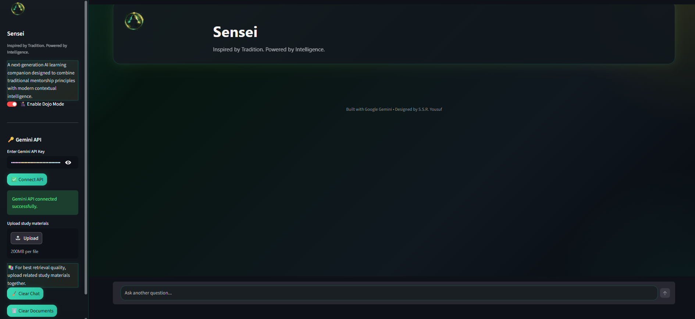

# 📚 Sensei: AI Study Companion
 


<div align="center">
  <a href="https://sensei-study-companion.streamlit.app/">
    
  </a>
</div>

---

> **⚠️ API REQUIREMENT NOTICE:**
Sensei runs on a Bring-Your-Own-Key (BYOK) model. You must possess a valid Google Gemini API Key to use the chat functionalities. Keys are held locally in your session state and are **never** stored permanently or transmitted outside the local runtime.

---
 
<p align="center">
  
</p>
<p align="center"><i>"Inspired by Tradition. Powered by Intelligence." — Dojo Mode UI shown above.</i></p>

---

## 📌 Project Overview
 
**Sensei** is a next-generation, AI-powered learning companion designed to replace passive reading with interactive, contextual exploration. Built entirely in Python using Streamlit and the Google Gemini API, it operates as a lightweight **Retrieval-Augmented Generation (RAG)** system.

Users can upload their study materials (Presentations, Code Notebooks, and PDF notes) and interrogate them via a conversational interface. Sensei provides a dual-layer response: a concise, AI-generated explanation, backed immediately by the raw, retrieved text from the user's own documents.

The primary engineering goal of Phase 1 was to build a robust, transparent retrieval engine **without** relying on heavy Vector Databases, focusing instead on logic, string manipulation, chunking algorithms, and UI explainability.
 
---
 
## 🚀 Core Features & Document Handling
 
### 📄 Multi-Format Document Ingestion
Sensei currently supports three highly distinct file formats, each requiring custom parsing logic:
- **PDFs (`.pdf`):** Parsed using `PyPDF2`, with aggressive text normalization to repair broken sentences and format paragraph chunks.
- **Jupyter Notebooks (`.ipynb`):** JSON-level extraction that cleanly separates Markdown text from executable Python code, rendering code in visually distinct formatting blocks.
- **PowerPoint (`.pptx`):** Iterates through slide shapes to extract textual information from lectures and presentations.

### 🧠 The Dual-Layer Response Engine
Instead of just giving an answer, Sensei proves its work:
1. **The Tutor Summary:** A concise, easy-to-understand explanation generated by Gemini based strictly on your documents.
2. **The Source Expanders:** Expandable UI elements colored by document type (🟥 PDF, 🟩 Notebook, 🟦 Slides) that display the exact chunks of text or code the AI used to formulate its answer.

### 🥷 Dojo Mode UI
A custom-built, premium CSS framework that overrides standard Streamlit styling. It introduces:
- Glassmorphism effects and animated shimmer borders.
- Custom scrollbars, input boxes, and chat message bubbles.
- A carefully chosen dark-theme color palette (Teal, Gold, Slate) designed to reduce eye strain during late-night study sessions.
 
---
 
## 🛠️ Architecture & Developer Notes
 
| Concern | Implementation |
|---|---|
| **Data Storage** | No Vector DBs. Uploaded files are text-extracted and serialized into local `documents_{session_id}.json` files for the duration of the runtime. |
| **Retrieval Engine** | Keyword-based matching with stop-word filtering. Uses a sliding **Context Window** algorithm to grab adjacent text chunks, ensuring no information is cut off mid-sentence. |
| **Notebook Safety** | Custom regex routines strip Base64-encoded images from Notebook markdown before rendering, preventing massive data blobs from cluttering the UI. |
| **Session Isolation** | Implements `uuid` tagging for chat and document JSON files to ensure multi-tab or multi-user instances do not overwrite each other's data. |
| **Prompt Engineering** | System prompts strictly confine the LLM to answer *only* using the provided context, heavily reducing AI hallucination. |
 
---
 
## 💻 Installation & Setup
 
### Prerequisites
 
Ensure you have **Python 3.10+** installed. 
 
**1. Clone the repository and navigate to the directory:**
```bash
git clone https://github.com/S-Yousuf-S/Sensei-AI.git
cd Sensei-AI
```

**2. Create and activate a virtual environment (Recommended):**
```bash
python -m venv sensei_env
# Windows:
sensei_env\Scripts\activate
# macOS / Linux:
source sensei_env/bin/activate
```
 
**3. Install dependencies:**
```bash
pip install streamlit google-generativeai PyPDF2 python-pptx pillow
```
 
**4. Launch the application:**
```bash
streamlit run sensei_fs_v8.1.py
```
*(Once running, paste your Gemini API key into the sidebar to connect the engine).*
 
---
 
## 📈 Version History
 
A selection of the key milestone versions shaping the current release.
 
| Version | Focus | Notes |
|---|---|---|
| v1.0 | Core AI | Basic Streamlit chat interface linked to Gemini API. |
| v4.2 | Ingestion | PDF and PPTX file reading capabilities added. |
| v7.3 | The Interface | Implementation of "Dojo Mode" CSS and standard source expanders. |
| v8.0 | File Structuring | Full support for `.ipynb` files including Markdown and Python code segregation. |
| v8.1 | **Current** | **Text Normalization update** — advanced Regex for PDF paragraph stitching, chunk truncation limits, and isolated session IDs. |
 
---

## 🙋 Frequently Asked Questions

**Q: Why doesn't Sensei use a Vector Database (like Pinecone or ChromaDB)?**<br>
**A:** This is a deliberate architectural choice for Phase 1. By relying on lightweight JSON serialization and keyword-chunking, Sensei remains highly portable, requires zero cloud infrastructure, and serves as an excellent foundational study in how Retrieval-Augmented Generation (RAG) logic actually works under the hood.

**Q: I got a `ResourceExhausted 429 Quota Exceeded` error. What happened?**<br>
**A:** You are likely using the Free Tier of the Gemini API. Google currently limits the `gemini-3-flash` model to a specific number of requests per day on the free tier. Take a break, and your quota will reset shortly!

**Q: Is my API key safe?**<br>
**A:** Yes. Your API key is injected directly into the Streamlit session state and passed securely to Google's servers. It is never logged, saved to disk, or visible anywhere in the codebase. 

**Q: Why do my PDF Source Expanders have so much text in them?**<br>
**A:** Sensei is designed to over-retrieve rather than under-retrieve. If it finds a keyword, it grabs the surrounding paragraphs (the Context Window) to ensure Gemini has all the nuance needed to give you a complete answer. 

**Q: Will you add support for Word or Excel files?**<br>
**A:** Yes! Excel (`.xlsx`) and Word (`.docx`) integration is planned for the next major development phase.

---

## 🎯 Conclusion
 
Sensei proves that you don't need highly complex, enterprise-level infrastructure to build an effective, AI-driven educational tool. By focusing on clean text parsing, smart prompt engineering, and a beautiful UI, static notes can be transformed into a dynamic mentor.
 
---
 
## 👤 Author
 
**Yousuf S. R. Sakkaf**

GitHub: [S-Yousuf-S](https://github.com/S-Yousuf-S)
 
---
 
⭐ *If you found this tool useful for your studies, consider leaving a star!*
